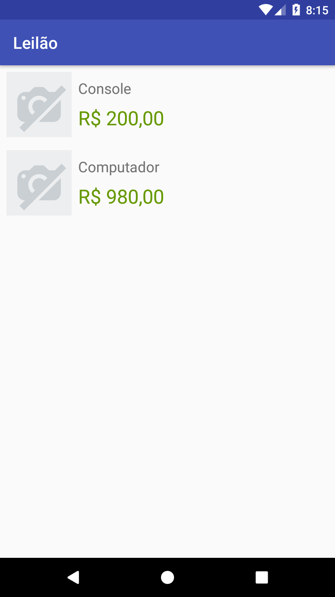

<h1 align="center">
  Testes Automatizados e TDD pt 2
</h1>

<p align="center">
  <a href="#rocket-project">Projects</a>&nbsp;&nbsp;&nbsp;|&nbsp;&nbsp;&nbsp;
  <a href="#computer-technologies">Technologies</a>&nbsp;&nbsp;&nbsp;|&nbsp;&nbsp;&nbsp;
  <a href="#thinking-how-to-use">How to use?</a>&nbsp;&nbsp;&nbsp;|&nbsp;&nbsp;&nbsp;
  <a href="#memo-license">License</a>
</p>

## :rocket: Project

:globe_with_meridians:  https://cursos.alura.com.br/course/android-boas-praticas-e-cenarios-testes


## Preview

<div style="display: flex">


</div>

## :computer: Technologies
- [Android](https://developer.android.com/)
- [Java](https://docs.oracle.com/javase/7/docs/api/)

## :thinking: How to use?

```sh
Open this project on Android Studio
```

```sh
Run App (shift + f10)
```


## :memo: License

MIT
